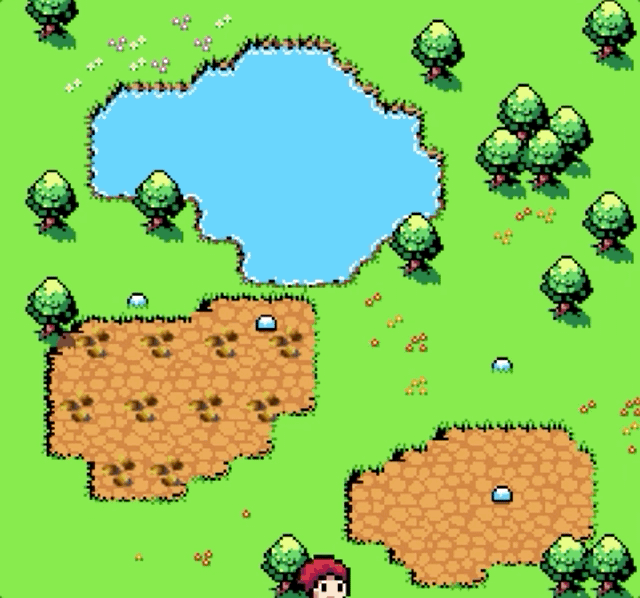

# Save the Village

### Project Details
Project utilizes the p5.play Javascript Library. Use the arrow keys to move the character and the mouse to interact with on-screen objects. Fill up your water bucket at the lake and water the corn plants!
 
# Game Overview
## Watering plants and save the village
 

#### [----> Click me to play the game!](https://replit.com/@AmyBian/Save-the-Village)

### Tech stack
- Javascript 
- p4.js
- CSS 

### Game design 
- Detect position to fill in the water when walking to the lake
- Fetch the water and display bucket with water as full or empty
- Walk with the water to the seeds 
- Grow effect of plants

### assets
Resources used in the game.

### index.html

The HTML file for webpage setup and libraries.
### ← style.css

 

